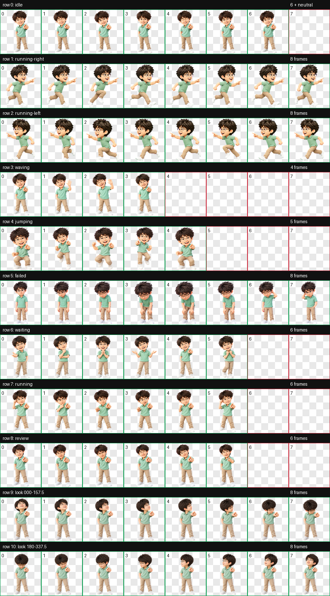

# Pip, Codex pet

Pip is an animated Codex pet. The character has dark tousled hair, rectangular glasses, a mint shirt, and a pointing pose.

Pip uses the Codex v2 pet sprite format. The WebP atlas is 1536 × 2288 pixels, with 8 columns and 11 rows. Each cell is 192 × 208 pixels. Rows 0 through 8 contain the standard animations. Rows 9 and 10 contain 16 clockwise look directions.

## Previews



[View the 16 look directions](previews/look-directions.png)

GIF previews for the standard animations are in [`previews/animations`](previews/animations).

## Install

Copy `pet.json` and `spritesheet.webp` into your Codex pets directory:

```sh
mkdir -p "$HOME/.codex/pets/pip"
cp pet.json spritesheet.webp "$HOME/.codex/pets/pip/"
```

## Attribution and license

The artwork and previews in this repository are licensed under [CC BY 4.0](https://creativecommons.org/licenses/by/4.0/). Suggested attribution: "Pip by @cuiliangruihai, licensed under CC BY 4.0." Note changes when you redistribute modified files. See [`LICENSE`](LICENSE).

The artwork was generated with AI assistance from a user-provided reference photo. The original photo is not included. This license covers only rights the contributor can grant. It does not grant publicity, privacy, or other rights held by the subject or third parties.

## 中文说明

Pip 是一个适用于 Codex 的动画宠物。精灵图采用 v2 格式，尺寸为 1536 × 2288 像素，共 8 列、11 行，每格 192 × 208 像素。第 0 到第 8 行是标准动画，第 9 行和第 10 行是顺时针排列的 16 个注视方向。

将 `pet.json` 和 `spritesheet.webp` 复制到 `$HOME/.codex/pets/pip/` 即可安装。动画总览和 16 方向预览见 `previews/`。

图稿和预览采用 CC BY 4.0。转载时请注明 Pip 来自 @cuiliangruihai，并说明所作修改。原始参考照片不包含在仓库中。许可只覆盖贡献者有权授权的权利，不包含人物肖像、隐私或第三方权利。
